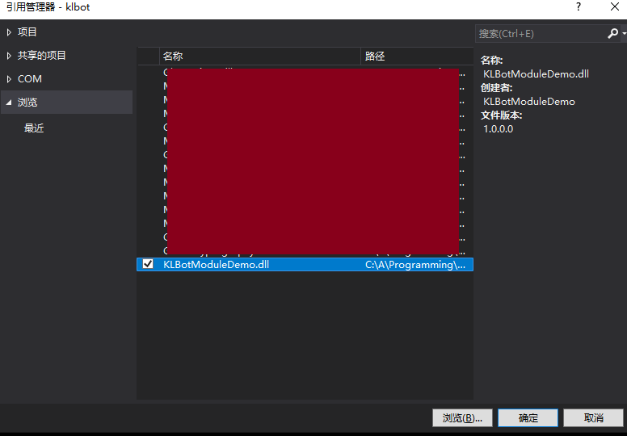
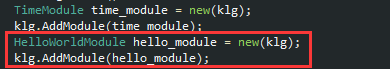

# KLBot实例开发手册

## KLBot实例管理员如何使用模块项目编译出的DLL文件

KLBot实例管理员只需要在项目依赖中引用模块编译出的DLL文件：

引用后，可以直接使用模块中定义的类。可以看到自动补全正常工作。

管理者根据自身需要，把模块以一定顺序添加到KLBot实例中，就可以向机器人添加相应功能。

> 在这个例子里，刚才编写的`HelloWorldModule`被放在报时模块`TimeModule`（详见《模块开发规范》）后面。

重新运行KLBot后，新加入的模块成功发挥功能，让机器人按照预期回复消息：

## 模块状态文件Hack

> **注意：**`[ModuleStatus]`只能控制KLBot是否**保存**这个属性到状态存档文件。在读取时，无论一个字段是否标记有`[ModuleStatus]`，只要它的值出现在状态存档文件里，KLBot就会把它导入模块的相应字段中。换言之，模块里的**所有字段**都可以通过读取状态存档文件来修改。这是为了给KLBot实例的管理者提供修改模块内部字段的hack通道。
