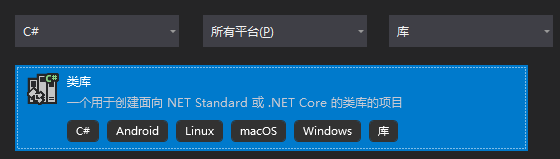
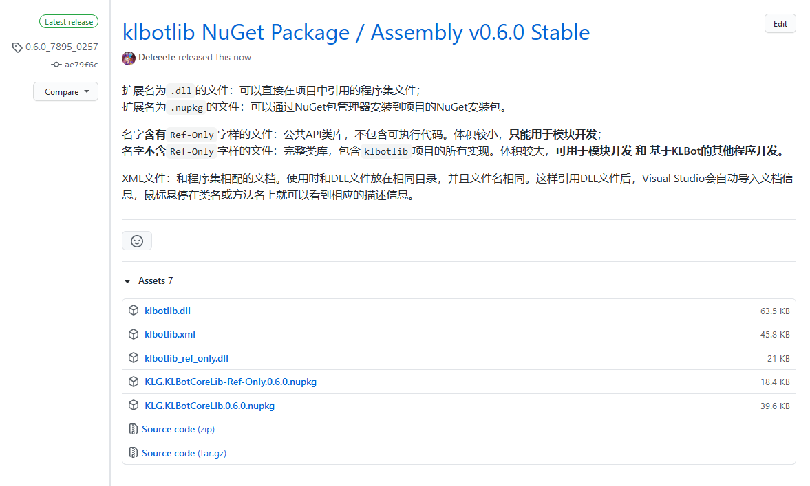

# 模块开发入门Q&A


## 目录

* 1. [准备工作](#)
	* 1.1. [Q: 要开始模块开发，电脑需要安装什么软件？](#Q:)
	* 1.2. [Q: 需要哪些前置知识？是否会很困难？](#Q:-1)
	* 1.3. [Q: 怎么入门？](#Q:-1)
	* 1.4. [Q: 写模块具体需要入门到哪个程度？](#Q:-1)
* 2. [开始](#-1)
	* 2.1. [Q: 应该创建什么类型的项目？](#Q:-1)
	* 2.2. [Q: 创建好项目后，从哪里开始呢？](#Q:-1)
		* 2.2.1. [1. 方法一：安装NuGet包](#NuGet)
		* 2.2.2. [2. 方法二：引用klbotlib.dll程序集](#klbotlib.dll)
	* 2.3. [Q: 引用好程序集就该写代码了，从哪里入手呢？](#Q:-1)
	* 2.4. [Q: Visual Studio要是真有这么牛逼，要我有什么用呢？](#Q:VisualStudio)
		* 2.4.1. [1.过滤器](#-1)
		* 2.4.2. [2.处理器](#-1)
		* 2.4.3. [3.模块功能总结](#-1)
	* 2.5. [Q: 怎么知道一条消息有没有@机器人？](#Q:-1)
* 3. [进阶](#-1)
	* 3.1. [Q: 为什么按照上面的教程写`msg.Text`会出错？](#Q:msg.Text)
	* 3.2. [Q: 过滤器返回的字符串有什么用呢？只要不为空或者null就可以随便乱写吗？](#Q:null)
	* 3.3. [Q: 我想发送纯文本之外的消息，怎么办？](#Q:-1)
		* 3.3.1. [1. 基本语法：](#-1)
		* 3.3.2. [2. 纯文本消息：](#-1)
		* 3.3.3. [3. 图像消息：](#-1)
		* 3.3.4. [4. 语音消息：](#-1)
	* 3.4. [Q: 我想让模块的某个字段能一直保存，重启也不丢失，怎么办？](#Q:-1)
	* 3.5. [Q: 我想引用其他模块，怎么办？](#Q:-1)
	* 3.6. [Q: 我想保存文件，怎么办？](#Q:-1)
	* 3.7. [Q: 我想发送信息，怎么办？](#Q:-1)


<hr>
<br>

##  1. <a name=''></a>准备工作

###  1.1. <a name='Q:'></a>Q: 要开始模块开发，电脑需要安装什么软件？

A: 首推Visual Studio。安装器可以在[这里](https://visualstudio.microsoft.com/zh-hans/thank-you-downloading-visual-studio/?sku=Community&rel=15#)获取。

> 当然，理论上只要电脑上安装了任何支持 **.NET Standard 2.0**的SDK，绝大部分文本编辑器都能满足需要。

但是如果使用Visual Studio，就可以不用关心SDK问题。只需要在Visual Studio安装时勾选.NET工作负载。如图所示。


<br>

###  1.2. <a name='Q:-1'></a>Q: 需要哪些前置知识？是否会很困难？

A: 模块开发难度的**上限**实际上取决于你想开发的模块的功能有多复杂。对于上限，两个问题的答案都是看情况。

但klbot通过建立一个完整的框架，尽一切可能把模块开发难度的**下限**降到了最低。因此，对于那些功能简单的模块来说，答案是，完成模块开发只需要了解C#的基本语法和少量面向对象知识，实现也相当简单。

换句话说，对项目的整体理解在任何情况下都不会成为模块开发的门槛。你只需要按照规则，在模块开发的框架里把想要的功能实现出来，其他发送消息、统计、管理之类的杂活，框架都已经帮你包办——这也是模块化的初衷之一。

<br>

###  1.3. <a name='Q:-1'></a>Q: 怎么入门？

A: 可以通过菜鸟教程或微软官方的C#教程（或者其他类似网站）在线学习；记得善用安装好的Visual Studio进行实践。

<br>

###  1.4. <a name='Q:-1'></a>Q: 写模块具体需要入门到哪个程度？

A: 除去最基本的内容，具体来说，还需要了解的内容有：

* 基类、派生类和继承的概念
* 重写（`override`）的概念

如果你确定自己了解最基本的内容（语法和基本概念）+以上两点，就已经能开始尝试开发一个自己的模块了。

<hr>
<br>

##  2. <a name='-1'></a>开始

###  2.1. <a name='Q:-1'></a>Q: 应该创建什么类型的项目？

A: 启动Visual Studio后，点击右侧下方的`创建新项目`。在新页面中的三个下拉列表里依次选择`C#`、`所有平台`、`库`。在底下的列表中选择`类库--一个用于创建面向.NET Standard或.NET Core的类库的项目`，如图：



点下一步，在新页面里设置你想要的名字和保存路径，再次下一步。

目标框架可以选择高于`.NET Standard 2.0`（含自身）、低于`.NET 5.0`（含自身）的任何版本（注意：下拉菜单里越向下版本越高）。

最后点击`创建`，就可以创建自己的模块项目了。

<br>

###  2.2. <a name='Q:-1'></a>Q: 创建好项目后，从哪里开始呢？

A: 根据模块开发规范，模块必须继承`Module`类或其派生类。为了实现这一点，也为了能够正常调用各种API，需要先引用KLBot核心库`klbotlib`的程序集文件。完成这一步后，KLBot里定义的所有公共类和基础设施就都能为你所用了。

引用方式有两种：

* 在项目里安装KLBotCoreLib NuGet包
    
    * 优点：自带文档；
    * 缺点：操作略微麻烦

* 添加对`klbotlib.dll`的引用
    
    * 优点：操作简单；
    * 缺点：如果想看到文档，需要手动下载

####  2.2.1. <a name='NuGet'></a>1. 方法一：安装NuGet包
到klbot项目的[Release页面](https://github.com/Deleeete/klbot/releases)选择版本下载。



> 只需要下载扩展名为`.nupkg`的文件

> 如果你只进行模块开发，没有打算构建自己的KLBot，可以下载体积更小更快速的`KLB.KLBotCoreLib-Ref-Only.*.*.*.nupkg`。这个程序包只包含公共类和公共API的定义，适用于模块开发。

下载完成后，回到Visual Studio，在菜单栏中点击`工具`->`NuGet 包管理器`->`管理解决方案的NuGet程序包...`。


在新页面右上侧可以看到`程序包源`，右边有一个设置图标。点击设置图标，弹出设置窗口。


设置窗口中，`计算机范围内的程序包源`下方的路径，就是Visual Studio当前正在使用的本地NuGet包路径。把刚才下载的文件复制到这个目录里。


回到Visual Studio并关闭设置窗口，点击`程序包源`右边的下拉列表，选择`Microsoft Visual Studio Offline Packages`。


在左上侧选中`浏览`选项卡，点击搜索框右边的刷新图标。刷新完成后应该可以看到`KLG.KLBotCoreLib`（或`KLG.KLBotCoreLib-Ref-Only`）出现在列表里。如果列出的包太多了不好找，可以在搜索框中手动搜索。


点击列表里的`KLG.KLBotCoreLib`，勾上需要安装的项目，然后点击安装，等待安装完成。


####  2.2.2. <a name='klbotlib.dll'></a>2. 方法二：引用klbotlib.dll程序集

在klbot项目的[Release页面](https://github.com/Deleeete/klbot/releases)选择版本下载。

> 主要下载扩展名为`.dll`的文件。如果你想在使用类时看到文档，可以多下载一个`klbotlib.xml`。

> 如果你只进行模块开发，没有打算构建自己的KLBot，可以下载体积更小更快速的`klbotlib_ref_only.dll`。这个程序集只包含公共类和公共API的定义，适用于模块开发。

> 如果你希望看到文档而且下载的是`ref_only`版本，那么下载后，需要把`klbotlib_ref_only.dll`重命名为`klbotlib.dll`，并且和`klbotlib.xml`放在同一目录下。

在解决方案资源管理器里，在你的项目上右键->`添加`->`项目引用`。在弹出的引用管理器里，左侧选择底下的`浏览`选项卡，然后点击右下角浏览。定位到刚才下载的`klbotlib.dll`（或`klbotlib_ref_only.dll`），选择文件然后添加引用。


<br>

以上两种方法都可以把相关定义导入你的模块开发项目。导入后就可以正常使用`klbotlib`项目中定义的类了。

从语法高亮中可以看出，`Module`类确实被成功引入项目中。如果用方法一安装或使用方法二并下载了`klbotlib.xml`，鼠标悬停在相关内容上时，还能看到文档信息：


<br>

###  2.3. <a name='Q:-1'></a>Q: 引用好程序集就该写代码了，从哪里入手呢？

A: 首先，你需要创建一个公共类。这个类就代表着你自己的模块。

出于规范，你给这个类起的名字应该以`Module`结尾，并且定义在`klbotlib.Modules`命名空间里。这里不妨假设你写的模块叫`HelloWorldModule`。

写出来大概像这样：

```CSharp
namespace klbotlib.Modules
{
    public class HelloWorldModule
    { 
        //目前这里还什么都没有
    }
}
```

接下来，再次根据模块开发规范，这个类应该继承`Module`类。换句话说，你需要在`HelloWorldModule`后面添加`: Module`。这样它就能继承这个模块：

```CSharp
namespace klbotlib.Modules
{
    public class HelloWorldModule : Module
    { 
        //目前这里还什么都没有
    }
}
```

Visual Studio会迅速在你定义的类下方画红线：


这是因为你没有实现`Module`类所必需的一些方法。一个模块需要有一个**过滤器**和一个**处理器**，但Visual Studio发现你没有定义并实现这两个东西，所以它不干了。

<br>

我们暂时先不管过滤器和处理器是什么，点击下面的`显示可能的修补程序`->`实现抽象类`。Visual Studio会自动帮你把该写的地方都先写出来，错误随之消失了。

###  2.4. <a name='Q:VisualStudio'></a>Q: Visual Studio要是真有这么牛逼，要我有什么用呢？

A: 在上一个问题中，Visual Studio帮你写的东西类似：

```CSharp
namespace klbotlib.Modules
{
    public class HelloWorldModule : Module
    { 
        public override string Filter(Message msg)
            => throw new NotImplementedException(); //这句话意思是 运行到这 就出问题

        public override string Processor(Message msg, string filter_out)
            => throw new NotImplementedException(); //同上
    }
}
```

所以其实它只是帮你写了上面的模板，下面真正实现功能的地方直接摆烂。到头来还是要自己写。

要能够自己写，就需要知道过滤器（`Filter(Message)`）和处理器（`Processor(Message, string)`）到底是两个什么玩意。

简单来说，过滤器决定一个模块**处理哪些消息**，处理器决定一个模块**怎么处理这些消息**。**我们通过写自己的过滤器和处理器，就能控制模块的行为。**

####  2.4.1. <a name='-1'></a>1.过滤器
过滤器接收一个`Message`对象，然后返回一个字符串。这个`Message`对象，显然就是传进来的QQ消息了。当一条消息传给过滤器，返回的消息结果是`null`或者空字符串`""`，即：

```CSharp
(Filter(msg) == null || Filter(msg) == "") == true;
```

那么这代表它不处理这条消息。

反过来，如果不是这样，则这代表它会处理这条消息。

举个例子，如果我们希望自己的模块**只处理总字数超过3的消息**，只需要让：

1. 字数超过3的时候，返回任意不为空的字符串；

2. 字数没超过3的时候，返回`null`（或者`""`）。

那么`Filter()`可以这么改：

```CSharp
namespace klbotlib.Modules
{
    public class HelloWorldModule : Module
    { 
        public override string Filter(Message msg)
        //过滤器底下改成了我们自己写的内容
        {
            
            //在这个阶段，简单起见，假设传入的消息都是纯文本消息，假设Message类有Text字段
            if (msg.Text.Length > 3)    //如果消息字数大于3
                return "yes";               //返回随便什么有内容的字符串都行
            else                        //否则
                return null;                //返回null
        }

        public override string Processor(Message msg, string filter_out)
            => throw new NotImplementedException(); //暂时还没改
    }
}
```

这样，模块就不会对任何字数不超过3的消息产生任何反应了。

####  2.4.2. <a name='-1'></a>2.处理器

处理器接收两个玩意：一个是和过滤器一样的`Message`对象，也就是待处理的消息；另一个是字符串，这个字符串正是上面过滤器的输出。用这两个东西，处理器可以对消息进行任何处理计算。

最后，处理器需要输出另一个字符串，这个字符串会被回复给消息的源头。也就是说，处理器输出的内容决定了这个模块最后回复的内容。

举个例子，如果我们希望自己的模块**把传进来的消息倒过来然后回复**，只需要让：

* 返回传进来的消息的倒序

那么`Processor()`可以这么改：

```CSharp
namespace klbotlib.Modules
{
    public class HelloWorldModule : Module
    { 
        //在这个阶段，简单起见，假设传入的消息都是纯文本消息，假设Message类有Text字段
        public override string Filter(Message msg)
        //过滤器底下改成了我们自己写的内容
        {
            if (msg.Text.Length > 3)    //如果消息字数大于3
                return "yes";               //返回随便什么有内容的字符串都行
            else                        //否则
                return null;                //返回null
        }

        public override string Processor(Message msg, string filter_out)
        //处理器的修改
        {
            return msg.Text.Reverse();  //返回传入的消息的倒序
        }
    }
}
```

这样，模块就会在接收到任何**成功通过了过滤器的**消息时，把消息倒过来复读一遍。

####  2.4.3. <a name='-1'></a>3.模块功能总结

结合上面的过滤器和处理器的小例子，我们实现了一个具有这样功能的模块：

* 当接收到的消息的长度不大于3时，完全没反应（过滤器返回`null`）；

* 当接收到的消息的长度大于3时，会把消息的内容逐字倒过来回复（过滤器返回`yes`，处理器返回原文的倒序）。

以上就是模块开发的一个极简例子。不管多复杂的模块开发，本质流程和上面的例子完全相同。

<br>

###  2.5. <a name='Q:-1'></a>Q: 怎么知道一条消息有没有@机器人？

A: 判断一条消息是否@了某个人，可以用`Message.TargetContains(id)`函数。其中id为需要判断的QQ号。返回`true`时答案为是，反之亦然。

模块所属的机器人保存在模块的`HostBot`字段里，而机器人的ID可以通过机器人的`SelfID`字段获取。

综上，判断一条消息`msg`是否@了机器人，可以写为：

`msg.TargetContains(HostBot.SelfID)`

<br>


<hr>
<br>

##  3. <a name='-1'></a>进阶


###  3.1. <a name='Q:msg.Text'></a>Q: 为什么按照上面的教程写`msg.Text`会出错？

A: 因为`Message`类实际上并没有这个字段。`Message`类是所有消息的基类，但显然并不是所有的消息都有文本内容，所以这个字段其实并不存在。在上面的例子里直接使用是为了方便演示。

真正有`Text`文本字段的类有纯文本消息`MessagePlain`和图文消息`MessageImagePlain`。

为了得到只存在于某种特定类型消息的字段，你可以：

* 手动进行类型判断
    1. 在过滤器里判断传入消息的类型，不合适的类型返回`null`；
    2. 在处理器里把传入的消息对象强制转换为想要的类型，然后访问那个字段。
        
        因为经过了过滤器，所以能到达处理器的消息必然都能安全强制转换，无需额外判断。

或者

* 自动判断（推荐）
    1. 如果你的模块只处理纯文本消息，让你的模块继承`SingleTypeModule<T>`；

        其中`T`是这个模块想处理的消息的类型。
    2. 这样，过滤器和处理器的传入消息参数自动就是想要的类型，不需要写任何额外代码。

<br>

###  3.2. <a name='Q:null'></a>Q: 过滤器返回的字符串有什么用呢？只要不为空或者null就可以随便乱写吗？

A: 这个设计是为了让过滤器和处理器之间允许一定程度的信息流动。

在上面的例子里，我们看到，过滤器输出的字符串`"yes"`并没有什么用。把它改成随便什么字符串都不会有影响。

这是因为我们只处理单独一种情况——即**总字数大于3的消息**。

如果判断一条消息是否需要处理**很麻烦**，而且又有**多于一种**处理模式，在不利用这个过滤器字符串输出的情况下，过滤器和处理器的编写就会十分痛苦。因为过滤器中已经计算判断过的消息，为了分类处理，到了处理器中还得再判断一次。

为了说明这其中的逻辑，举个略微极端的例子。假设有个奇怪的模块希望实现（不考虑溢出和潜在的加速算法）：

* 如果消息字数的阶乘的阶乘的阶乘的第335位是奇数，则回复原消息的前3个字；

* 如果消息字数的阶乘的阶乘的阶乘的第335位是偶数，则回复原消息的前2个字。

> 这个`阶乘的阶乘的阶乘`显然是很大的数字，算出它需要花费不少时间。

稍加思考可以发现：

1. 过滤器必然需要计算这个`阶乘的阶乘的阶乘`，才能决定是否应该过滤这条消息；
2. 处理器也必然需要计算这个`阶乘的阶乘的阶乘`，才能决定是应该返回前几个字。

这意味着，相同的东西我们计算了两遍，非常愚蠢。

这时，过滤器的字符串输出就能派上用场——它可以作为情况分类的标签，在过滤器和处理器之间传递。

例如，过滤器可以这样实现：

* 如果那堆阶乘的第335位是奇数，则返回`"奇数！"`；

* 如果是偶数，则返回`"偶数！"`；

* 否则，返回`null`。

接下来，相应地，处理器就可以直接通过判断第二个参数，即`Processor(Message msg, string filter_out)`中的`filter_out`来确定情况是哪一种：

* 如果`filter_out == "奇数！"`，则返回`msg.Text`的前3位；

* 如果是偶数，则返回`msg.Text`的前2位；

这样就避免了相同的计算和判断不得不在过滤器和处理器上重复执行两遍的问题。

<br>

###  3.3. <a name='Q:-1'></a>Q: 我想发送纯文本之外的消息，怎么办？

A: 为了让模块能方便地输出文本之外的消息，KLBot框架设计了一种特殊的标记语言`MsgMarker`。模块可以通过返回MsgMarker文本来输出文本之外的消息。

####  3.3.1. <a name='-1'></a>1. 基本语法：
`\类型:\参数1:值1:\参数2:值2...`

####  3.3.2. <a name='-1'></a>2. 纯文本消息：
`文本内容`

也就是说，任何不带`\xxx`前缀的消息都会被当成纯文本消息处理。

在文本中内插表情：

`...其他文本...{\face:表情名称}...其他文本...`

在文本中内插@：

`...其他文本...{\tag:目标QQ号}...其他文本...`

####  3.3.3. <a name='-1'></a>3. 图像消息：

基于URL发送图片：
`\image:\url:URL字符串`

基于Base64发送图片：
`\image:\base64:Base64字符串`

####  3.3.4. <a name='-1'></a>4. 语音消息：

基于URL发送语音：
`\voice:\url:URL字符串`

基于Base64发送语音：
`\voice:\base64:Base64字符串`

<br>

###  3.4. <a name='Q:-1'></a>Q: 我想让模块的某个字段能一直保存，重启也不丢失，怎么办？

A: 在这个字段上添加`[ModuleStatus]`属性。具体可参考[模块开发规范](./模块开发规范.md)-第4.2.1部分的内容。

<br>

###  3.5. <a name='Q:-1'></a>Q: 我想引用其他模块，怎么办？

A: 使用API函数`ModuleAccess.GetModule<T>(int index)`。

其中`T`是想引用的模块的类型，`index`是该模块在同类型模块中的排位。

比如，有三个嘴臭模块`FuckModule`，你想引用第二个，则应该调用`ModuleAccess.GetModule<FuckModule>(1)`。

<br>

###  3.6. <a name='Q:-1'></a>Q: 我想保存文件，怎么办？

A: 使用`Module.Cache`底下的API函数。目前包括：

* `FileExist(string relative_path);`

    返回模块缓存目录中是否存在某个文件

* `SaveFileAsString(string relative_path, string text);`

    保存文本到模块缓存目录

* `SaveFileAsBinary(string relative_path, byte[] bin);`

    保存二进制到模块缓存目录

* `ReadFileAsString(string relative_path);`

    从模块缓存目录里读取文本

* `ReadFileAsBinary(string relative_path);`

    从模块缓存目录里读取二进制

* `DeleteFile(string relative_path);`

    从模块缓存目录里删除文件

所有`relative_path`参数都是相对于模块缓存目录的路径。

<br>

###  3.7. <a name='Q:-1'></a>Q: 我想发送信息，怎么办？

A: 使用`Module.Messaging`下的API函数。目前包括：

* `SendMessage(MessageContext context, long user_id, long group_id,string content);`
    
    发送消息API

* `ReplyMessage(Message origin_msg, string content);`
    
    回复消息API

* `SendGroupMessage(long group_id, string content);`
    
    发送群聊消息API

* `SendGroupMessage(long user_id, long group_id, string content);`
    
    发送临时消息API

* `SendPrivateMessage(long user_id, string content);`
    
    发送私聊消息API


