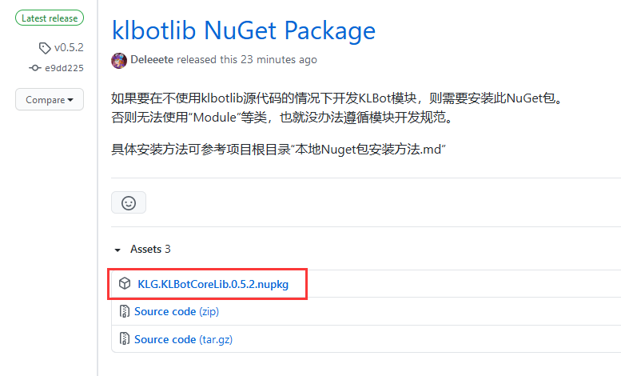
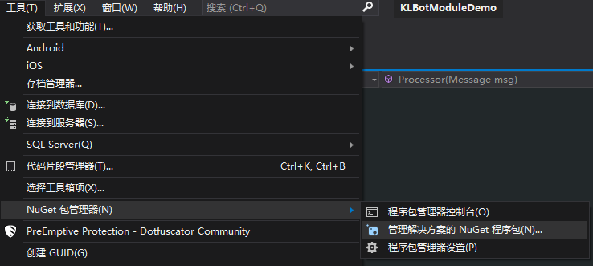
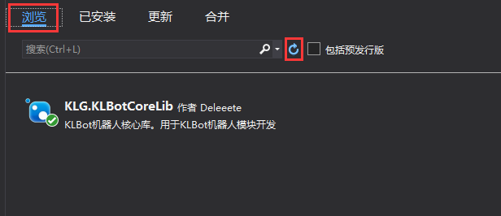
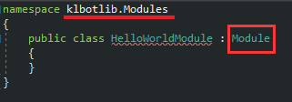
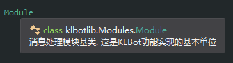
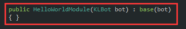
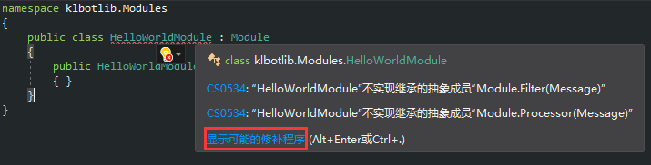
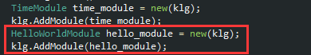

# 闭源模块开发示例
### ---- 此教程在Visual Studio 2019 版本16.10.2上测试有效

 

## 一、下载NuGet包文件
到klbot项目的[Release页面](https://github.com/Deleeete/klbot/releases)选择版本下载。
> 只需要下载扩展名为`.nupkg`的文件。文件名形式为`KLG.KLBotCoreLib.*.*.*.nupkg`。

## 二、安装NuGet包
### 1. 复制NuGet包文件到Visual Studio本地NuGet路径
在Visual Studio中创建或打开你自己的模块开发项目，在菜单栏中点击`工具`->`NuGet 包管理器`->`管理解决方案的NuGet程序包...`。

在新页面右上侧可以看到`程序包源`，右边有一个设置图标。点击设置图标，弹出设置窗口。

设置窗口中，`计算机范围内的程序包源`下方的路径，就是Visual Studio当前正在使用的本地NuGet包路径。把刚才下载的文件复制到这个目录里。

### 2. 查找并安装NuGet包
回到Visual Studio并关闭设置窗口，点击`程序包源`右边的下拉列表，选择`Microsoft Visual Studio Offline Packages`。

在左上侧选中`浏览`选项卡，点击搜索框右边的刷新图标。刷新完成后应该可以看到`KLG.KLBotCoreLib`出现在列表里。如果列出的包太多了不好找，可以在搜索框中手动搜索。

点击列表里的`KLG.KLBotCoreLib`，勾上需要安装的项目，然后点击安装，等待安装完成。

## 三、使用演示

安装完成后可以正常使用`klbotlib`项目中定义的类。

根据**模块开发规范**，把主类所在的命名空间改为`klbotlib.Modules`，并让主类继承`Module`类。

从语法高亮中可以看出，`Module`类确实被成功引入项目中。

另外，安装后也能看到编译到包中的文档信息：

首先，因为基类的构造函数有参数，所以没有显式实现构造函数会导致红框中的错误：

大部分情况下构造函数不需要做任何处理。因此只需要添加这两行就可以消除上述错误。

Visual Studio仍然会提醒我们，模块的**处理器**和**过滤器**尚未被实现。

可以点击`显示可能的修补程序`->`实现抽象类`来自动生成模板代码。

可以看到错误被全部消除了。因为在编译器看来，`Module`类已经被实现。

不过目前所谓“实现”只是抛出异常，所以下面简单实现这个`Hello`模块。

我们的目标是，让这个模块接收任意消息，且始终回复“Hello world”。修改`Filter()`和`Processor()`中的代码：

至此一个简单的HelloWorld模块开发完成。

最后只需要把这个类编译成DLL文件或NuGet包，然后发送给KLBot实例的管理员引用。

## 附：KLBot实例管理员如何使用模块项目编译出的DLL文件

KLBot实例管理员只需要在项目依赖中引用模块编译出的DLL文件：

引用后，可以直接使用模块中定义的类。可以看到自动补全正常工作。

管理者根据自身需要，把模块以一定顺序添加到KLBot实例中，就可以向机器人添加相应功能。

> 在这个例子里，刚才编写的`HelloWorldModule`被放在报时模块`TimeModule`（详见《模块开发规范》）后面。

重新运行KLBot后，新加入的模块成功发挥功能，让机器人按照预期回复消息：

